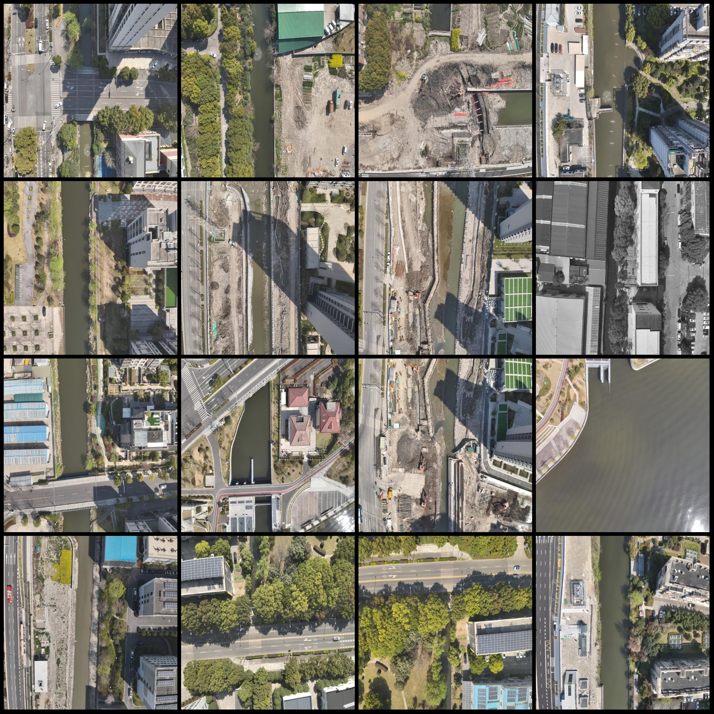
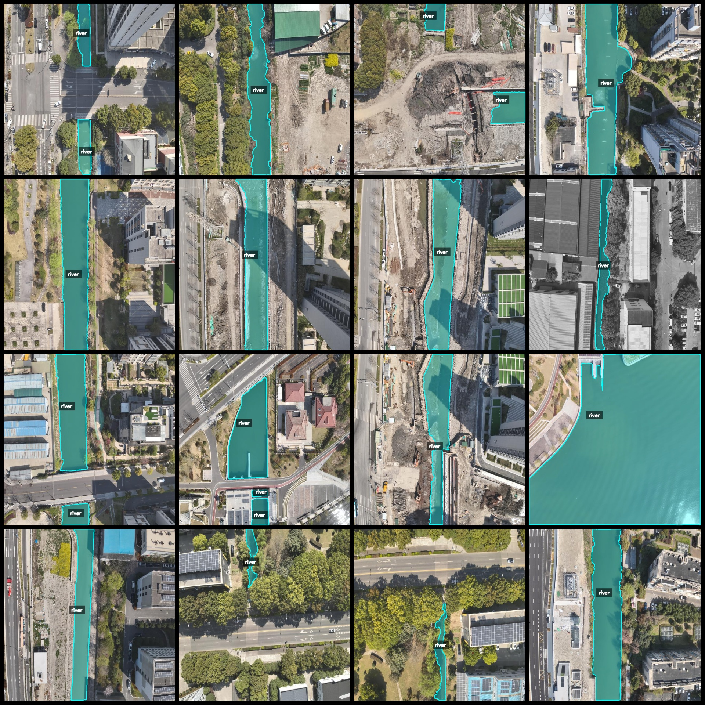
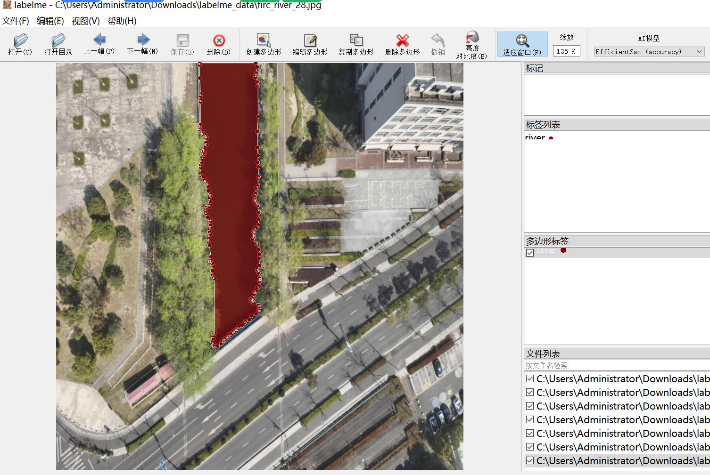

# Drone-Viewed Aerial Photo Survey Data for River Segmentation and Identification

## Dataset Format: labelme format (excluding mask files, only containing JPG images and corresponding JSON files)

### Image Count: JPG Files Number
Number of JPG files: 646

### Annotation Count: JSON Files Number
Number of JSON files: 646

### Number of Annotation Categories: 1

#### Annotation Category Name: ["river"]

Each category has an annotation count:
- River count = 938
- Total boxes: 938

### Annotation Tool: labelme=5.5.0

### Repository: firc-dataset

### Image Resolution: 640x640

### UAV: DJI M350rtk

### Collection Height: 300m

### Collection Angle: 90°

### Enhancing the Dataset: Approximately 200 are original images, the rest are enhanced images.

**Annotation Rules:** Polygons are drawn around the categories.

**Important Notice:** The dataset can be edited using labelme, but the JSON dataset needs to be converted into a mask or Yolo format or COCO format for semantic segmentation or instance segmentation.

**Special Disclaimer:** This dataset does not guarantee the accuracy of the trained models or weight files.

**Image Preview:**

---

**Annotation Example:**
- **Original Image:**

- **Annotation Drawing Results:**

The polygons are drawn around the "river" category, as shown in the image below:

- **Labelme Editing Image Example:**

## Picture

Here is a pay link on Stripe ( https://buy.stripe.com/3cs8yP7sY87d0vu9AB ). Please contact me lonlonago@foxmail.com after funding $89, and I will send you a complete data files , thank you!

